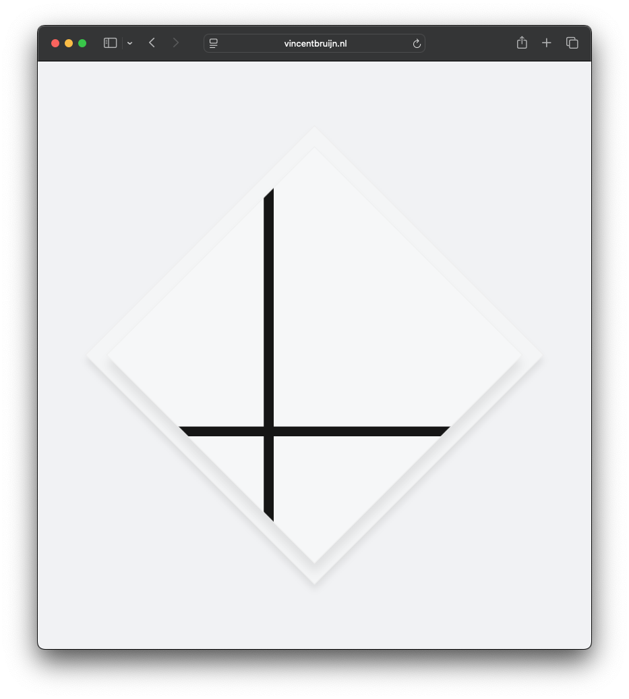

# Perlin Noise Discovery and Port

A JavaScript port of Ken Perlin's improved noise algorithm from Java, featuring interactive visualizations and a Piet Mondrian-inspired animation.

## Overview

This project demonstrates the porting of Ken Perlin's Improved Noise algorithm from Java to JavaScript, along with several HTML demonstrations showcasing different applications of the noise function.

## Files

### Core Implementation

- `ImprovedNoise.java` - Original Java reference implementation by Ken Perlin (2002)
- `ImprovedNoise.js` - JavaScript port of the improved noise algorithm
- `noise-2d.js` - Additional 2D noise utilities
- `other-noise.js` - Alternative noise implementations
- `Ball.java` - Java utility class

### Demonstrations

#### index.html

Basic Perlin noise visualization displaying 5,000 small squares arranged in a grid pattern. The noise values control the grayscale color of each square, creating an organic, cloud-like pattern.

#### index2.html

Animated demonstration featuring 100 floating circles with:

- Random colors and transparency
- Perlin noise-driven movement
- Smooth 60fps animation
- Organic, flowing motion patterns

#### index3.html - "Lozenge Composition with two Perlin Noise Lines"

A sophisticated homage to Piet Mondrian's geometric compositions featuring:

- Diamond-rotated canvas (45-degree rotation)
- Two animated black lines controlled by Perlin noise
- Minimalist aesthetic with subtle shadows
- Responsive design that adapts to viewport orientation
- Smooth 30fps animation creating organic movement within geometric constraints

## Technical Details

### Perlin Noise Implementation

The JavaScript port maintains full compatibility with Ken Perlin's original Java implementation:

- Identical permutation table (256 values)
- Same fade, lerp, and grad functions
- Consistent output values across implementations
- Optimized for web performance

### Key Features

- **Faithful Port**: Direct translation maintaining mathematical accuracy
- **Browser Compatible**: Works in all modern browsers
- **Performance Optimized**: Efficient for real-time animation
- **Multiple Demos**: Various applications from simple to artistic

## Usage

1. Open any of the HTML files in a web browser
2. `index.html` - Static noise pattern visualization
3. `index2.html` - Animated floating particles
4. `index3.html` - Mondrian-inspired geometric animation

## Dependencies

- No external JavaScript libraries required
- Uses native HTML5 and CSS3 features
- Node.js dependencies listed in `package.json` for development

## Credits

- **Ken Perlin** - Original Improved Noise algorithm (2002)
- **Vincent Bruijn** - JavaScript port and artistic implementations
- Inspired by Piet Mondrian's geometric compositions

## License

ISC License - See package.json for details

## References

- [Ken Perlin's Noise Page](https://mrl.cs.nyu.edu/~perlin/noise/)
- Original paper reference: `paper445.pdf`

Unless stated otherwise (c) 2022
Vincent Bruijn <vebruijn@gmail.com>
